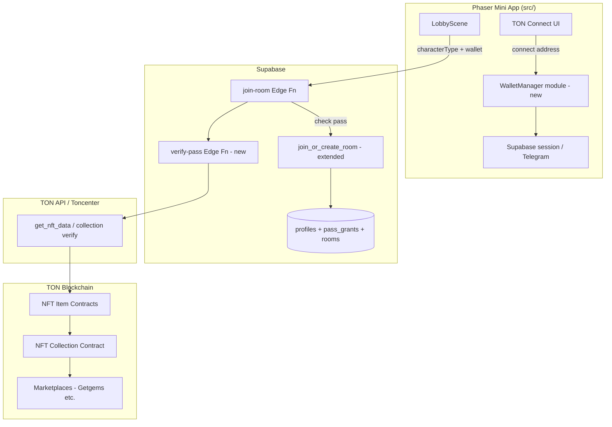
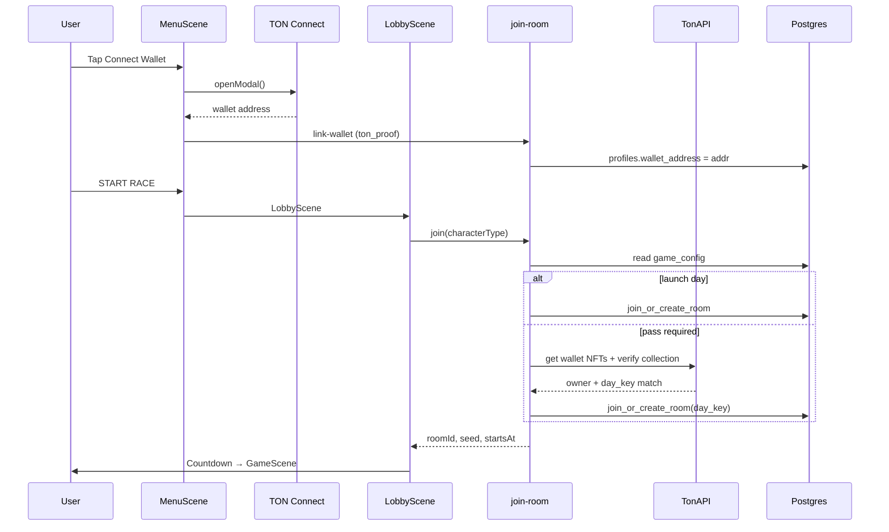

# BugEaters — TON Blockchain Integration Plan

**Status:** Implemented on testnet (September 2026) — see [`TON_TESTNET_RUNBOOK.md`](./TON_TESTNET_RUNBOOK.md) for the switch-on steps and file map. This document remains the design rationale.  
**Last updated:** June 2026 (plan) · September 2026 (status)  
**Audience:** Developers implementing weekly tournament NFT passes + wallet gating for the Telegram Mini App

> **What shipped vs. this plan:** §6 stack (`@tonconnect/ui`, `@ton/core`/`@ton/ton`, func-js instead of Blueprint), §7 reference TEP-62 collection (vendored in `contracts/`), §8 `src/ton/TonConnectService.ts` + `ton_proof` link (`link-wallet`), §9 on-chain checks (`pass-burn`, `sync-passes`), §10 as `0015_ton_nft.sql`. The weekly model replaces §4/§12 "daily pass": passes are week-scoped, **minted by the race server** to winners and **burned in the lobby** (transfer to `0:00…00`).

> **Product model updated:** Stakeholder decisions changed the design from a simple “calendar daily pass” to a **weekly Monday-start tournament chain**. Read **[`TON_WEEKLY_TOURNAMENT_MODEL.md`](./TON_WEEKLY_TOURNAMENT_MODEL.md)** first; sections below that describe “daily pass / day_key / unlimited races” are **legacy** until rewritten in a future doc pass.

This document is the **technical blueprint** for TON Connect, TEP-62 NFTs, Supabase gating, and implementation phases. Product rules (weekday chain, one pass = one race, multiplayer-only) live in the weekly tournament doc.

---

## Table of contents

1. [Goals and non-goals](#1-goals-and-non-goals)
2. [Current state audit](#2-current-state-audit)
3. [Compliance requirements](#3-compliance-requirements)
4. [Product model: NFT daily pass](#4-product-model-nft-daily-pass)
5. [High-level architecture](#5-high-level-architecture)
6. [TON technology stack](#6-ton-technology-stack)
7. [Smart contracts (on-chain)](#7-smart-contracts-on-chain)
8. [Wallet integration (client)](#8-wallet-integration-client)
9. [Pass verification (server)](#9-pass-verification-server)
10. [Database and API changes](#10-database-and-api-changes)
11. [Client UX and scene integration](#11-client-ux-and-scene-integration)
12. [Global daily races (`day_key`)](#12-global-daily-races-day_key)
13. [Secondary market and trading](#13-secondary-market-and-trading)
14. [Environment variables and secrets](#14-environment-variables-and-secrets)
15. [Implementation phases](#15-implementation-phases)
16. [Testing strategy](#16-testing-strategy)
17. [Security and abuse prevention](#17-security-and-abuse-prevention)
18. [Open decisions](#18-open-decisions)
19. [Reference links](#19-reference-links)

---

## 1. Goals and non-goals

### Goals

| Goal | Source |
|------|--------|
| **NFT daily pass** required to join daily races after launch day | `game_design.md`, `GAME_OVERVIEW.md` |
| Passes are **tradable** on TON NFT marketplaces (TEP-62) | `game_design.md` |
| **Day 1 completely free** — no wallet, no NFT | `game_design.md` |
| **Global daily races** — everyone races the same calendar day (`day_key`) | `GAME_OVERVIEW.md` (schema exists) |
| **Telegram Mini App compliant** — TON only, TON Connect only | [Telegram Blockchain Guidelines](https://core.telegram.org/bots/blockchain-guidelines) |
| Gate matchmaking server-side so clients cannot bypass | `GAME_OVERVIEW.md` → “Gate in `join-room` or new RPC” |

### Non-goals (this phase)

- In-game currency, shops, or jetton rewards
- Pay-to-win items affecting race speed
- Ethereum / Solana / any non-TON chain
- Custom wallet connection (MetaMask, WalletConnect-only flows outside TON Connect)
- iOS React Native port crypto (`ios-handoff/` explicitly defers NFT to later)
- Minting pass NFTs inside the game UI on day one (admin/cron minting is enough for MVP)
- On-chain race results or standings (Supabase remains source of truth for gameplay)

---

## 2. Current state audit

### What exists today

```
Telegram Mini App (index.html + telegram-web-app.js)
    → Phaser 3 client (src/)
    → Supabase Auth via telegram-auth Edge Function (initData HMAC)
    → join-room → join_or_create_room RPC → rooms / room_members
    → Realtime multiplayer (RoomSession)
```

| Area | Status | Relevant files |
|------|--------|----------------|
| Telegram auth | ✅ Implemented | `src/net/auth.ts`, `supabase/functions/telegram-auth/` |
| Matchmaking | ✅ Implemented | `supabase/functions/join-room/`, `0002_matchmaking.sql` |
| `day_key` column | ✅ Schema only | `supabase/migrations/0001_init.sql` — never set or checked |
| Wallet / TON Connect | ❌ None | — |
| NFT contracts | ❌ None | — |
| Pass gating | ❌ None | — |
| `profiles` wallet link | ❌ None | `profiles` has `telegram_id`, `username` only |

### Extension points already documented

From `GAME_OVERVIEW.md`:

- **Global daily races:** `join_or_create_room` + `day_key`, scheduled `starts_at`
- **NFT daily pass:** Gate in `join-room` or new RPC

These are the exact hooks we will use.

---

## 3. Compliance requirements

Telegram Mini Apps with blockchain **must** follow [Blockchain Guidelines](https://core.telegram.org/bots/blockchain-guidelines):

| Rule | Our obligation |
|------|----------------|
| Assets on **TON only** | Deploy NFT collection on TON mainnet (testnet for dev) |
| **TON Connect only** for wallet interactions | Use `@tonconnect/ui` or `@tonconnect/sdk` — do not fork the SDK |
| No promotion of non-TON wallets for in-app signing | Marketing copy stays TON-native |
| New assets since Jan 21, 2025 must be TON-based | Daily pass collection deploys on TON |

TON Connect is the **mandatory** wallet protocol for Telegram Mini Apps using TON ([TON Connect overview](https://docs.ton.org/applications/ton-connect/overview)).

**Important:** TON Connect handles wallet sessions and transaction signing. It does **not** read the blockchain for us. We must add RPC/indexer calls separately ([AppKit](https://docs.ton.org/applications/appkit/howto/nfts) or `@ton/ton` + Toncenter/TonAPI).

---

## 4. Product model: NFT daily pass

### Concept

A **Daily Pass** is a TEP-62 NFT item in a BugEaters collection. Each item grants the holder the right to **enter matchmaking for a specific calendar race day**.

| Property | Value |
|----------|-------|
| Standard | [TEP-62](https://github.com/ton-blockchain/TEPs/blob/master/text/0062-nft-standard.md) (NFT item + collection) |
| Metadata | [TEP-64](https://github.com/ton-blockchain/TEPs/blob/master/text/0064-token-data-standard.md) off-chain JSON |
| Tradable | Yes — standard NFT `transfer` message; **not** soulbound |
| Consumed on use? | **No** — ownership for that day is checked at join time; pass remains in wallet and can be sold |
| Launch day | **Free** — server skips NFT check when `day_key` equals configured launch date |

### `day_key` format

Use **UTC calendar date** string for global consistency:

```
day_key = "2026-06-10"   // ISO date, race day in UTC
```

Stored on `rooms.day_key` (column already exists). All rooms created for a given global daily event share the same `day_key`.

### NFT metadata shape (TEP-64)

Each pass item carries attributes the server will trust **only after on-chain verification** (metadata alone is not proof):

```json
{
  "name": "BugEaters Daily Pass — 2026-06-10",
  "description": "Entry pass for the global BugEaters race on 2026-06-10 (UTC).",
  "image": "https://cdn.bugeaters.example/pass/2026-06-10.png",
  "attributes": [
    { "trait_type": "day_key", "value": "2026-06-10" },
    { "trait_type": "edition", "value": "global-daily" },
    { "trait_type": "game", "value": "bugeaters" }
  ]
}
```

Server verification will **not** parse JSON for authorization. It will:

1. Confirm the NFT item belongs to our **collection contract address** (anti-fake-NFT).
2. Read `owner_address` from the item contract at join time.
3. Optionally cross-check `day_key` from indexer metadata for UX (display only).

### User journeys

**Launch day (free):**

```
Menu → START RACE → Lobby → Game
(no wallet required)
```

**Day 2+ without pass:**

```
Menu → START RACE → Lobby
    → join-room returns 402 PASS_REQUIRED
    → UI: "Connect wallet" + "Get Daily Pass" (marketplace link / mint page)
```

**Day 2+ with pass:**

```
Menu → Connect wallet (TON Connect) → START RACE → Lobby
    → join-room verifies NFT ownership server-side → Game
```

**Buying pass on secondary market:**

```
User acquires NFT externally (Getgems, etc.)
    → opens BugEaters → connects wallet → races same day if before daily cutoff
```

---

## 5. High-level architecture

### Target system



### Trust boundaries

| Layer | Trust level |
|-------|-------------|
| Client wallet address | **Untrusted** until `ton_proof` verified and stored |
| Client “I own a pass” flag | **Never trusted** |
| Server on-chain read via indexer | **Trusted** for join-time ownership |
| Supabase `join-room` with service role | **Authoritative** gate for matchmaking |
| NFT metadata JSON | **Untrusted** display data only |

### Dual identity model

BugEaters will have **two linked identities**:

1. **Telegram / Supabase user** — gameplay, matchmaking, standings (existing).
2. **TON wallet address** — NFT ownership (new).

Link stored in `profiles.wallet_address` after TON Connect + optional `ton_proof` verification.

---

## 6. TON technology stack

### Recommended packages

| Package | Role | Why for BugEaters |
|---------|------|-------------------|
| `@tonconnect/ui` | Wallet connect UI in browser | Phaser is **not** React — vanilla JS SDK per [TON Connect get started](https://docs.ton.org/applications/ton-connect/get-started) |
| `@tonconnect/sdk` | Headless connector (optional) | Edge Function verification of `ton_proof` |
| `@ton/ton` + `@ton/core` | Address parsing, cell decoding | Server-side `get_nft_data` stack parsing |
| `@ton/appkit` | NFT read helpers (optional) | Higher-level `getNfts` / `getNft` if we add a small React admin shell later |
| `@ton/blueprint` or `tact` | Smart contract dev & deploy | Standard path per [NFT minting guide](https://docs.ton.org/v3/guidelines/dapps/tutorials/nft-minting-guide) |

**Do not use** `@tonconnect/ui-react` in the Phaser client unless we add a separate React shell.

### Network IDs (TON Connect transactions)

| Network | `chainId` in TON Connect |
|---------|-------------------------|
| Mainnet | `-239` |
| Testnet | `-3` |

### Hosting: `tonconnect-manifest.json`

Required before any wallet connect ([manifest rules](https://docs.ton.org/applications/ton-connect/get-started)):

```json
{
  "url": "https://play.bugeaters.example",
  "name": "BugEaters",
  "iconUrl": "https://play.bugeaters.example/icon-180.png",
  "termsOfUseUrl": "https://play.bugeaters.example/terms",
  "privacyPolicyUrl": "https://play.bugeaters.example/privacy"
}
```

**Hosting requirements:**

- Public `GET`, HTTPS, no auth, no CORS blocking wallets
- Icon: **180×180 PNG** (not SVG)
- File path: `public/tonconnect-manifest.json` → served at `/tonconnect-manifest.json` in Vite build

### Telegram Mini App return URL

After wallet flows, return users to the bot ([TON Connect JS guidelines](https://old-docs.ton.org/v3/guidelines/ton-connect/frameworks/web)):

```javascript
tonConnectUI.uiOptions = {
  actionsConfiguration: {
    twaReturnUrl: 'https://t.me/YOUR_BOT_NAME'
  }
};
```

---

## 7. Smart contracts (on-chain)

### New repo area (planned)

```
contracts/                    # NEW — Blueprint/Tact project
├── wrappers/
├── scripts/
│   ├── deployCollection.ts
│   └── mintDailyPass.ts
├── contracts/
│   └── daily_pass_collection.tact   # or FunC fork of reference NFT
└── README.md
```

Keep contracts **separate** from Phaser `src/` but versioned in the same monorepo.

### Collection design

Base: [TON reference NFT implementation](https://docs.ton.org/blockchain-basics/standard/tokens/nft/nft-reference) (TEP-62 compliant).

| Component | Responsibility |
|-----------|----------------|
| **Collection contract** | Stores `next_item_index`, collection metadata, `nft_item_code`; mints items |
| **Item contracts** | Per-pass ownership; handles `transfer` for tradability |

### Minting model

Per [How to deploy an NFT item](https://docs.ton.org/blockchain-basics/standard/tokens/nft/deploy):

- Collection **owner** (BugEaters admin wallet) sends internal message `op=1` (deploy single item) with:
  - `itemIndex` — sequential index
  - `recipientAddress` — initial owner (treasury, giveaway wallet, or minter)
  - `content` — TEP-64 item content cell pointing to metadata URI

**MVP minting flow (off-game):**

1. Cron/admin script runs daily (or batch weekly) to mint passes for upcoming `day_key` dates.
2. Passes sold/distributed via:
   - Direct sale site (future)
   - Marketplace listing (Getgems)
   - Airdrop to treasury then users buy

**Not required for MVP:** In-game `sendTransaction` mint button (adds complexity).

### Pass authenticity

Scammers can deploy fake NFTs that claim our collection address. Verification **must** go through the collection ([How to verify an NFT item](https://docs.ton.org/blockchain-basics/standard/tokens/nft/verify)):

```
1. get_nft_data(item) → index, collection_address, owner_address
2. get_nft_address_by_index(collection, index) → address
3. Assert returned address == item address
4. Assert collection_address == OUR_COLLECTION
5. Assert owner_address == user's linked wallet
```

### Optional: dedicated pass logic contract

For MVP, **standard TEP-62 NFTs are sufficient**. A custom contract is only needed if we later want:

- On-chain “redeem” burns
- Soulbound passes (conflicts with tradable vision)
- Royalty enforcement beyond [TEP-62 royalties](https://github.com/ton-blockchain/TEPs/blob/master/text/0062-nft-standard.md)

**Recommendation:** Stick to reference NFT collection for v1.

---

## 8. Wallet integration (client)

### New module: `src/ton/`

Planned files (not created yet):

```
src/ton/
├── TonConnectService.ts    # Singleton wrapper around @tonconnect/ui
├── types.ts                # WalletState, PassStatus enums
├── manifest.ts             # manifest URL from env
└── passStatus.ts           # Client-side UX hints (server is authoritative)
```

### Integration with Phaser

Phaser scenes are not a SPA framework. Pattern:

1. **Initialize TON Connect once** in `src/main.ts` before `new Phaser.Game()`, or in `BootScene.create()`.
2. Mount connect button into a **HTML overlay** `div` positioned above the canvas (same pattern as many Phaser + DOM UI games), **or** use `tonConnectUI.openModal()` from a Phaser text button.
3. Subscribe `onStatusChange` → store wallet address in `TonConnectService` → optionally sync to Supabase.

```typescript
// Planned shape — illustrative only
import { TonConnectUI } from '@tonconnect/ui';

const tonConnectUI = new TonConnectUI({
  manifestUrl: import.meta.env.VITE_TONCONNECT_MANIFEST_URL,
  buttonRootId: 'ton-connect-button', // div in index.html
});

tonConnectUI.onStatusChange((wallet) => {
  // address available at wallet?.account?.address (raw format)
});
```

### Link wallet to Supabase profile

New Edge Function: `link-wallet`

1. Client connects via TON Connect with `ton_proof` payload (nonce from server).
2. Client POSTs `{ proof, walletAddress }` to `link-wallet`.
3. Server verifies proof per TON Connect spec → updates `profiles.wallet_address`.

This prevents users from typing someone else's address.

### When to require wallet in UI

| Scenario | Wallet required? |
|----------|----------------|
| Launch day race | No |
| Practice / solo mode (no Supabase) | No |
| Daily race after launch | Yes, before `join-room` |
| Viewing pass in inventory | Yes (connect to show NFTs) |

---

## 9. Pass verification (server)

### New Edge Function: `verify-pass` (or inline in `join-room`)

**Input:**

```typescript
{
  dayKey: string;           // "2026-06-10"
  walletAddress: string;    // user-friendly or raw — normalize server-side
}
```

**Output:**

```typescript
{
  valid: boolean;
  reason?: 'LAUNCH_DAY_FREE' | 'NO_WALLET' | 'NO_PASS' | 'NOT_OWNER' | 'FAKE_NFT' | 'ON_SALE';
  nftAddress?: string;
}
```

### Algorithm (server-side)

```
function verifyPass(wallet, dayKey):
  if dayKey == LAUNCH_DAY_KEY:
    return valid=true, reason=LAUNCH_DAY_FREE

  if not wallet:
    return valid=false, reason=NO_WALLET

  nfts = queryIndexer(wallet, collection=COLLECTION_ADDRESS)
  for nft in nfts:
    if not verifyInCollection(nft.address, COLLECTION_ADDRESS):
      continue
    if nft.isOnSale:
      continue  // owner is sale contract; realOwner may not be user
    if metadata.attributes.day_key == dayKey:  // optional UX check
      return valid=true

  return valid=false, reason=NO_PASS
```

**Critical:** Use `get_nft_data` owner check immediately before allowing join. Indexer lag can show stale ownership ([NFT AppKit docs](https://docs.ton.org/applications/appkit/howto/nfts) warn about stale reads).

### `join-room` changes

Extend `supabase/functions/join-room/index.ts`:

```
1. Compute today's dayKey (UTC) or accept from client (server validates)
2. Load profile.wallet_address for auth.uid()
3. If pass required → verifyPass(wallet, dayKey)
4. If invalid → 402 { error: 'pass_required', reason }
5. Else → join_or_create_room(..., p_day_key => dayKey)
```

### Indexer choice

| Provider | Use |
|----------|-----|
| [Toncenter API](https://toncenter.com/api/v2/) | `runGetMethod` for `get_nft_data` |
| [TonAPI](https://tonapi.io/) | Higher-level NFT account endpoints |
| [@ton/appkit](https://docs.ton.org/applications/appkit/howto/nfts) `getNfts` | If we accept SDK in Deno Edge (bundle size concern) |

**Recommendation:** TonAPI or Toncenter from Edge Function with API key in secrets; cache results for **≤30 seconds** max (not minutes).

---

## 10. Database and API changes

### Migration: `0005_ton_wallet.sql` (planned)

```sql
-- Link TON wallet to Telegram profile
alter table public.profiles
  add column if not exists wallet_address text,
  add column if not exists wallet_linked_at timestamptz;

create unique index if not exists profiles_wallet_address_idx
  on public.profiles (wallet_address)
  where wallet_address is not null;

-- Optional: audit pass verifications (anti-replay analytics)
create table if not exists public.pass_checks (
  id            bigint generated always as identity primary key,
  user_id       uuid not null references auth.users (id),
  day_key       text not null,
  wallet_address text not null,
  nft_address   text,
  valid         boolean not null,
  reason        text,
  created_at    timestamptz not null default now()
);

-- Game config singleton (launch day, collection address)
create table if not exists public.game_config (
  key   text primary key,
  value text not null
);

insert into public.game_config (key, value) values
  ('launch_day_key', '2026-06-10'),
  ('nft_collection_address', 'EQ...'),
  ('pass_required', 'false')  -- flip to true after launch day
on conflict (key) do nothing;
```

### RPC: extend `join_or_create_room`

Add parameter:

```sql
p_day_key text default null
```

Behavior changes:

- When creating a room, set `rooms.day_key = p_day_key`.
- When joining existing room, prefer rooms matching `p_day_key` (global daily bucket).
- For global daily event: also align `starts_at` to scheduled world start (future cron).

### New Edge Functions summary

| Function | Purpose |
|----------|---------|
| `link-wallet` | Verify `ton_proof`, save `profiles.wallet_address` |
| `wallet-nonce` | Issue nonce for ton_proof challenge |
| `verify-pass` | Standalone pass check (optional; can be internal) |
| `join-room` (modify) | Enforce pass + pass `day_key` into RPC |

---

## 11. Client UX and scene integration

### `index.html`

Add overlay container:

```html
<div id="ton-connect-button"></div>
```

Style to sit in safe area (top-right), matching black/white aesthetic.

### `MenuScene.ts`

| UI element | Behavior |
|------------|----------|
| Wallet chip | Shows truncated address or “Connect Wallet” |
| Pass badge | “Today: FREE” on launch day; “Pass required” / “Pass OK” after |
| START RACE | Enabled always; pass check happens in lobby join |

### `LobbyScene.ts`

On `session.join(character)` failure:

| Error code | UX |
|------------|-----|
| `pass_required` | Overlay: connect wallet + link to get pass |
| `wallet_not_linked` | Prompt connect + link flow |
| Network | Existing offline → solo fallback (only when Supabase down, not when pass missing) |

**Product decision:** When pass is required, **do not** silently fall back to solo. User should understand they need a pass.

### `EndScene.ts`

Optional: show “You raced on {day_key}” for daily event branding.

### New scene (optional): `PassScene.ts`

Dedicated screen explaining daily pass, marketplace links, FAQ. Accessible from menu.

---

## 12. Global daily races (`day_key`)

### Vision

Everyone shares the same race day. Parallel rooms (already implemented) shard players; `day_key` groups them into one logical “world event.”

### Scheduling (planned)

| Component | Responsibility |
|-----------|----------------|
| `game_config.daily_start_utc` | e.g. `"18:00"` — global start hour |
| Cron / Edge Function `open-daily-rooms` | At start time, pre-create seed rooms with shared `day_key` + fixed `starts_at` |
| `join_or_create_room` | Prefer today's `day_key` rooms before creating ad-hoc |

### Relationship to NFT pass

```
day_key = "2026-06-10"
pass NFT attribute day_key = "2026-06-10"
→ must match for join on that day
```

After UTC midnight, yesterday's pass no longer grants access to today's races (user needs today's pass).

---

## 13. Secondary market and trading

Tradability is **built into TEP-62** — no extra game code for P2P transfers.

| Platform | Notes |
|----------|-------|
| [Getgems](https://getgems.io/) | TON-native; reference NFT contracts supported |
| Tonkeeper / Wallet in Telegram | Users can send NFT to another address |

Game responsibilities:

- Use **standard reference NFT** for marketplace compatibility
- Provide **collection address** in docs / UI for verification
- Do **not** build custodial marketplace in v1

Royalty (optional): TEP-62 royalty params on transfer — configure at collection deploy if desired.

---

## 14. Environment variables and secrets

### Client (`.env.local` / Vite)

```bash
# Existing
VITE_SUPABASE_URL=...
VITE_SUPABASE_ANON_KEY=...

# NEW — TON
VITE_TONCONNECT_MANIFEST_URL=https://play.bugeaters.example/tonconnect-manifest.json
VITE_TON_NETWORK=mainnet          # or testnet
VITE_NFT_COLLECTION_ADDRESS=EQ... # for client-side NFT display only
VITE_TELEGRAM_BOT_USERNAME=YourBot
```

### Server (Supabase Edge Function secrets)

```bash
# Existing
TELEGRAM_BOT_TOKEN=...
SUPABASE_SERVICE_ROLE_KEY=...

# NEW — TON
TON_NETWORK=mainnet               # or testnet
NFT_COLLECTION_ADDRESS=EQ...
LAUNCH_DAY_KEY=2026-06-10
PASS_REQUIRED=true                # false during launch day
TON_API_KEY=...                   # Toncenter or TonAPI
TONAPI_BASE_URL=https://tonapi.io/v2
```

### Contract deploy wallet (local / CI only — never in client)

```bash
MNEMONIC=...                      # collection owner wallet
```

---

## 15. Implementation phases

### Phase 0 — Prerequisites (no game code)

- [ ] Register Telegram bot + Mini App URL (HTTPS)
- [ ] Create 180×180 PNG app icon
- [ ] Deploy `tonconnect-manifest.json` to production host
- [ ] Create Toncenter/TonAPI account and API key
- [ ] Decide launch `day_key` date

### Phase 1 — Smart contracts (testnet)

- [ ] Init Blueprint project in `contracts/`
- [ ] Deploy TEP-62 collection to testnet
- [ ] Mint test pass NFTs with `day_key` metadata
- [ ] Document collection address in `game_config`

### Phase 2 — Wallet connect (client)

- [ ] Add `@tonconnect/ui` dependency
- [ ] Add `src/ton/TonConnectService.ts`
- [ ] Update `index.html` with connect button container
- [ ] `twaReturnUrl` for Telegram return
- [ ] Wallet chip on `MenuScene`

### Phase 3 — Profile linking (server)

- [ ] Migration `0005_ton_wallet.sql`
- [ ] `wallet-nonce` + `link-wallet` Edge Functions
- [ ] `ton_proof` verification (Deno crypto)
- [ ] Client: “Link wallet” flow after connect

### Phase 4 — Pass verification (server)

- [ ] `verify-pass` logic (indexer + collection verify)
- [ ] Extend `join-room` with gating
- [ ] Extend `join_or_create_room` with `p_day_key`
- [ ] `game_config` for launch day + pass_required flag

### Phase 5 — Client gating UX

- [ ] `LobbyScene` error handling for `pass_required`
- [ ] Pass status on menu (query `verify-pass` or lightweight endpoint)
- [ ] Marketplace / get-pass links

### Phase 6 — Global daily event

- [ ] Scheduled `starts_at` alignment
- [ ] Cron to open daily room pools
- [ ] `day_key` filtering in matchmaking

### Phase 7 — Mainnet launch

- [ ] Deploy collection to mainnet
- [ ] Mint launch day passes (if any promotional supply)
- [ ] Set `PASS_REQUIRED=true` after launch `day_key`
- [ ] Monitor `pass_checks` table for failures

---

## 16. Testing strategy

### Local dev

| Mode | Setup |
|------|-------|
| Solo (unchanged) | No `VITE_SUPABASE_*` → no crypto |
| Multiplayer without pass | `PASS_REQUIRED=false` in secrets |
| Pass gating | `PASS_REQUIRED=true`, testnet collection |

### Testnet workflow

1. Deploy collection to testnet (`chainId -3`).
2. Use [Tonkeeper testnet](https://tonkeeper.com/) or Telegram Wallet testnet mode.
3. Mint pass to test wallet.
4. Connect in game → link wallet → join room with matching `day_key`.

### Manual test cases

| # | Case | Expected |
|---|------|----------|
| 1 | Launch day, no wallet | Join succeeds |
| 2 | Post-launch, no wallet | `pass_required` |
| 3 | Post-launch, wallet, no NFT | `pass_required` |
| 4 | Post-launch, wallet, wrong day NFT | `pass_required` |
| 5 | Post-launch, wallet, correct NFT | Join succeeds |
| 6 | NFT on sale (`isOnSale`) | Denied until sale cancelled |
| 7 | Fake NFT (wrong collection) | Denied |
| 8 | Transfer pass mid-lobby | Next join attempt reflects new owner after indexer refresh |

### Automated tests (planned)

- Deno unit tests for `verify-pass` with mocked TonAPI responses
- SQL tests for `join_or_create_room` day_key filtering
- No on-chain tests in CI (manual testnet smoke only)

---

## 17. Security and abuse prevention

| Threat | Mitigation |
|--------|------------|
| Client fakes ownership | Server-only verification via `get_nft_data` |
| Fake NFT contracts | Collection `get_nft_address_by_index` check |
| Stale indexer ownership | Re-fetch immediately before join; short cache only |
| Wallet address spoofing | `ton_proof` on link-wallet |
| Replay join without pass | `join-room` checks every time, not cached client-side |
| Sybil with anonymous auth | Production requires Telegram `initData`; disable anonymous in prod |
| Pass sharing | Allowed — tradable passes can be sold; one wallet per join |
| Bot scraping TonAPI | Rate limit `verify-pass`; API key on server only |

---

## 18. Open decisions

**Resolved (June 2026)** — see [`TON_WEEKLY_TOURNAMENT_MODEL.md`](./TON_WEEKLY_TOURNAMENT_MODEL.md):

| Topic | Decision |
|-------|----------|
| Week cycle | Tournament starts **every Monday** |
| **Monday** | **Web2 only** — everyone joins, **no wallet / no NFT** |
| Tue–Sun | Wallet + pass NFT (**burn on join**) |
| Mode | **Multiplayer only** — no solo in production |
| Pass use | **One pass = one race** |
| Pass chain | Win day *D* → NFT → entry day *D+1*; buy from winners |
| Pass distribution | **Dynamic progressive** — forgiving early, stricter toward Sunday |
| **Saturday** | **≤6 rooms worldwide**; winner-only → **≤6 Sunday passes** |
| **Sunday** | **1–6 runners**; &lt;6 qualify → &lt;6 play |
| **Roles** | **Mon:** player picks · **Tue–Sun:** pass → **random** Bug/Human/Klaus |
| **Lanes (v1)** | **3 sub-lanes** per main lane — no scaling yet |
| **Champion (now)** | **Monday shoulder billboards** in-race — sellable to marketers |
| **Champion (later)** | Burn bundle, TON prize — **deferred** |
| Unlinked wallet | **Forfeit pass** |
| Scope | Full system |
| Build | **Not yet** |

**Still open** — [`TON_CRYPTO_DECISION_QUESTIONNAIRE.md`](./TON_CRYPTO_DECISION_QUESTIONNAIRE.md):

| # | Question |
|---|----------|
| 1 | **1-player Sunday** edge case |
| 2 | **Progressive curve** + global advancement budget (config) |
| 3 | **Billboard creative spec** — dimensions, link taps, #ad label |
| 4 | **Sponsored message moderation** policy |
| 5 | **Monday scheduling** — ready waves vs open queue |

---

## 19. Reference links

### Official — Telegram

- [Blockchain Guidelines for Mini Apps](https://core.telegram.org/bots/blockchain-guidelines)
- [Telegram Mini Apps (WebApps)](https://core.telegram.org/bots/webapps)

### Official — TON Connect

- [TON Connect overview](https://docs.ton.org/applications/ton-connect/overview)
- [Get started with TON Connect](https://docs.ton.org/applications/ton-connect/get-started)
- [TON Connect for JS (incl. TWA return URL)](https://old-docs.ton.org/v3/guidelines/ton-connect/frameworks/web)
- [TON Connect demo dApp (React)](https://github.com/ton-connect/demo-dapp-with-react-ui)

### Official — NFTs

- [TEP-62 NFT standard](https://github.com/ton-blockchain/TEPs/blob/master/text/0062-nft-standard.md)
- [TEP-64 token data standard](https://github.com/ton-blockchain/TEPs/blob/master/text/0064-token-data-standard.md)
- [NFT overview](https://docs.ton.org/blockchain-basics/standard/tokens/nft/overview)
- [NFT how it works](https://docs.ton.org/blockchain-basics/standard/tokens/nft/how-it-works)
- [NFT reference implementation](https://docs.ton.org/blockchain-basics/standard/tokens/nft/nft-reference)
- [Verify NFT belongs to collection](https://docs.ton.org/blockchain-basics/standard/tokens/nft/verify)
- [Deploy NFT item](https://docs.ton.org/blockchain-basics/standard/tokens/nft/deploy)
- [NFT minting tutorial](https://docs.ton.org/v3/guidelines/dapps/tutorials/nft-minting-guide)
- [AppKit — NFTs in dApps](https://docs.ton.org/applications/appkit/howto/nfts)

### BugEaters internal

- [`GAME_OVERVIEW.md`](../GAME_OVERVIEW.md) — game + backend architecture
- [`game_design.md`](../game_design.md) — original NFT daily pass vision
- [`supabase/migrations/0001_init.sql`](../supabase/migrations/0001_init.sql) — `day_key` column
- [`supabase/functions/join-room/`](../supabase/functions/join-room/) — matchmaking gate (extension point)

---

## Appendix A — File change map (implementation checklist)

| File / area | Change type |
|-------------|-------------|
| `contracts/*` | **New** — NFT collection |
| `public/tonconnect-manifest.json` | **New** |
| `public/icon-180.png` | **New** |
| `package.json` | Add `@tonconnect/ui`, `@ton/core` |
| `index.html` | Connect button `div` |
| `src/main.ts` | Init TonConnectService |
| `src/ton/*` | **New** module |
| `src/scenes/MenuScene.ts` | Wallet + pass UI |
| `src/scenes/LobbyScene.ts` | Pass error handling |
| `src/net/types.ts` | Join error types |
| `supabase/migrations/0005_ton_wallet.sql` | **New** |
| `supabase/migrations/0006_day_key_matchmaking.sql` | **New** |
| `supabase/functions/link-wallet/` | **New** |
| `supabase/functions/wallet-nonce/` | **New** |
| `supabase/functions/join-room/index.ts` | Pass gate |
| `.env.example` | TON vars |
| `GAME_OVERVIEW.md` | Update when implemented |

---

## Appendix B — Sequence diagram: join with pass



---

*This plan intentionally contains no production crypto code. When implementation begins, work through [Phase 15](#15-implementation-phases) in order and update `GAME_OVERVIEW.md` with the final architecture.*
