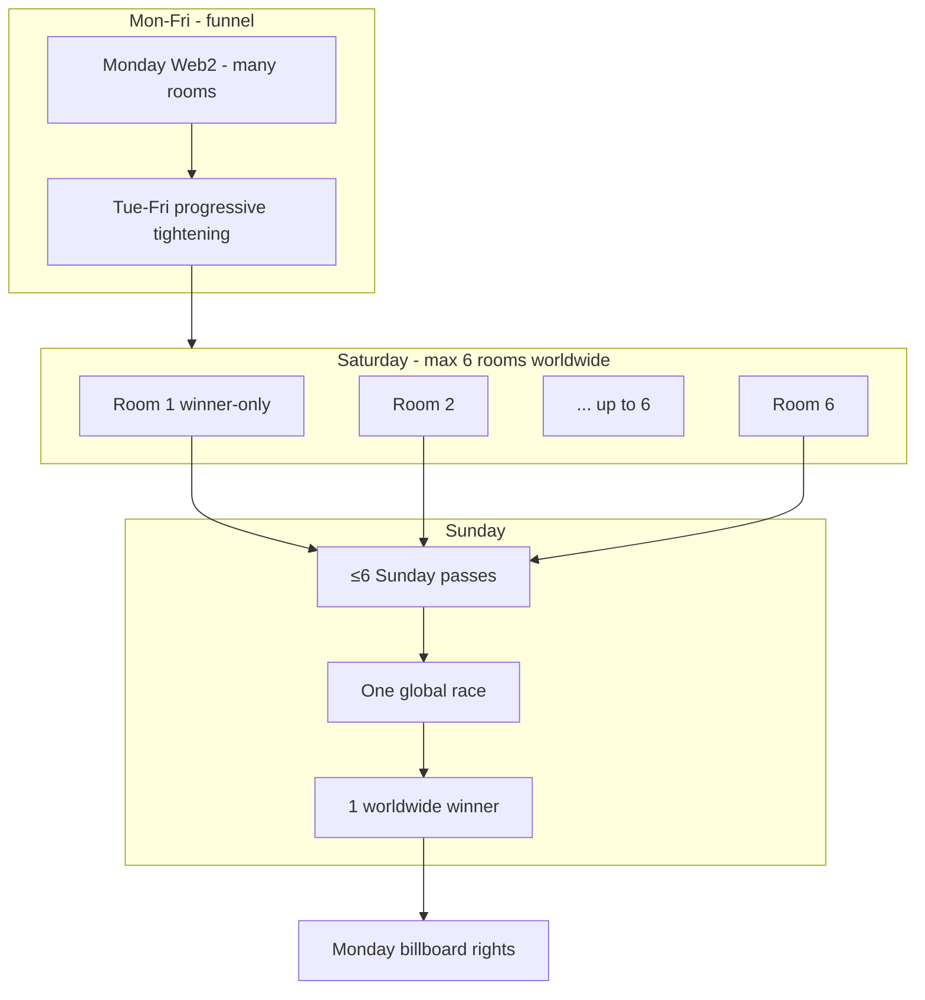

# BugEaters — Weekly Tournament & NFT Pass Model

**Status:** Product spec from stakeholder decisions (June 2026)  
**Build status:** Not implemented — planning only  
**Supersedes:** The simple “calendar daily pass” sections in [`TON_CRYPTO_IMPLEMENTATION_PLAN.md`](./TON_CRYPTO_IMPLEMENTATION_PLAN.md) where they conflict. Technical stack (TON Connect, TEP-62, Supabase gating) still applies.

---

## Summary in one paragraph

BugEaters is a **weekly global tournament** starting **every Monday**. **Monday is Web2-only** — no wallet, no NFT; **you pick your character**. **Tuesday–Saturday** use **single-use pass NFTs** (burned on join): win day *D* → earn pass → burn to race day *D+1*; **pass assigns a random role** (Bug, Human, or Klaus). **Pass distribution tightens through the week**. **Sunday** is one **global finale** with **1–6 runners** (hard cap 6 qualifiers; if fewer qualify, fewer play). **One worldwide winner** gets **Monday shoulder billboards** (sellable ad slot). **3 sub-lanes per main lane** for now. Scheduling: tap ready + timezone-aware. Unlinked wallet after Monday win → forfeit pass.

---

## Resolved decisions

| Topic | Decision |
|-------|----------|
| Week cycle | Tournament **starts every Monday** |
| **Monday entry** | **Everyone** — **no Web3** |
| Tue–Sat entry | Pass NFT + linked wallet; **burn on join** |
| Modes | **Multiplayer only** |
| Pass consumption | **One pass = one race** → **NFT burns** |
| Pass acquisition | Win previous day **or buy** from winner |
| **Pass distribution** | **Dynamic, progressive tightening** — forgiving early week, **fewer advance closer to Sunday** |
| **Sunday finale** | **One global game**, **1–6 runners** (qualifiers = runners), **one worldwide winner** |
| **Saturday** | **≤6 rooms worldwide**; winner-only per room → **≤6 Sunday passes** |
| **Sunday qualifiers** | **Hard cap: 6**; if &lt;6 qualify, &lt;6 play |
| **Pass-gated role** | **Tue–Sun:** burning pass → **random role** (Bug / Human / Klaus) — no menu pick |
| **Monday role** | **Player chooses** character (Web2 day, no pass) |
| **Lane layout (now)** | **3 sub-lanes per main lane** (9 playable) — no dynamic scaling yet |
| Min players (weekday rooms) | **6** to start a normal matchmaking wave |
| Min players (Sunday finale) | **1–6** — whatever qualified plays |
| Scheduling | Tap ready + optional time; timezone-aware |
| Wallets | TON Connect; one linked wallet (Tue+) |
| Unlinked wallet | **Forfeit pass** |
| Build now? | **No** |

---

## Progressive pass distribution (dynamic)

### Principle

| Phase of week | Who advances (gets next-day pass) |
|---------------|-----------------------------------|
| **Early** (Mon→Tue, Tue→Wed) | **Forgiving** — many finishers per room (cold start) |
| **Mid** (Wed→Thu, Thu→Fri) | **Narrowing** — fewer per room |
| **Late** (Fri→Sat, Sat→Sun) | **Strict** — winner-only or top 1 per room |

Exact numbers are **not fixed in product spec** — server reads **registered / ready player counts** and applies a **progressive curve** so Sunday funnels toward a **global finale**, not thousands of parallel Sunday winners.

### Example curve (illustrative — tune at implementation)

| Transition | Low population (forgiving) | Normal | Strict (pre-Sunday) |
|------------|---------------------------|--------|------------------------|
| Mon → Tue | Top 5 or all finishers | Top 4 | Top 3 |
| Tue → Wed | Top 4 | Top 3 | Top 3 |
| Wed → Thu | Top 3 | Top 3 | Top 2 |
| Thu → Fri | Top 3 | Top 2 | Top 2 |
| Fri → Sat | Top 2 | Top 2 | **Winner only** |
| Sat → Sun | **Winner only** (feeds global pool) | **Winner only** | **Winner only** |

**Rules engine (planned):**

```
advancement_slots(room, weekday) = f(global_registered_count, weekday, room_size=6)
// weekday later in week → smaller f
// global count lower → larger f (forgiving)
```

**Stakeholder intent:** First days forgiving; **closer to Sunday, fewer people get further** — automatic, not manual.

### Reference math (static top 3 only)

If **every day** were top 3 (not progressive), **384 Monday players** → **6 on Sunday** in one room — see [Pass supply math](#pass-supply-math).  
With **progressive tightening + one global winner**, Sunday is **not** “fill one room of 6” — it’s **qualify many → collapse to global finale → 1 winner**. Static tables are **lower-bound estimates** only.

---

## Global Sunday finale — one game, six seats, hard cap

### Decision

- **One Sunday race** for the entire world.  
- **Exactly 6 runners max** — the **qualifiers are the runners** (same people, same seats).  
- **Fewer than 6 qualify → fewer than 6 play** — no NPC backfill, no waiting for a 6th. A Sunday finale with **1, 2, 3, 4, or 5** players is valid.  
- **Exactly one winner** worldwide (even in a 1-player edge case — define win condition at implementation).  
- It must be **impossible** for more than **6** to qualify.



### How “impossible > 6” is enforced (design)

**Decided:** Never more than **6 Saturday rooms** globally. **Winner-only per room** → at most **6 Saturday winners** → at most **6 Sunday passes**. No ranking step, no FCFS.

| Layer | Enforcement |
|-------|-------------|
| **1. Saturday room cap** | `COUNT(saturday_rooms WHERE week_id = X) <= 6` — **7th room creation fails** |
| **2. Winner-only** | Each Saturday room mints **0 or 1** Sunday pass to that room’s winner |
| **3. Sunday pass cap** | At most **6** Sunday passes per `week_id` (follows from 1 + 2) |
| **4. Join gate** | Sunday `join-room` only for Sunday pass holders (max 6) |
| **5. Single Sunday room** | One global Sunday race; 1–6 runners |

**Overflow (MAY CHANGE):** If more players hold **Friday→Saturday pass** than fit in 6 rooms, define whether excess pass holders are turned away or queued — upstream funnel should ideally limit Saturday pass count to manageable pool.

### Still open (does not break the cap)

| # | Question |
|---|----------|
| 1 | **1-player Sunday** — auto-win vs still run clock? |
| 2 | **One global start time** for Sunday (tap-ready + timezone) |
| 3 | Non-finalists on Sunday — spectators only |

**Product lock:** `count(sunday_finalists WHERE week_id = X) <= 6`; Sunday field size = finalist count (1–6).

---

## Lane layout — 3 sub-lanes for now

### Decision

| Topic | Now | Later (deferred) |
|-------|-----|------------------|
| Sub-lanes per main lane (Bug / Human / Klaus) | **3 each** → **9 playable** (matches current game) | May scale sub-lane count with player population |
| Sunday runner count | **6** | Fixed at 6 even if lanes scale later |
| Design in `game_design.md` | “Scale lanes with players” | **Not implementing yet** — revisit when traffic warrants |

No change to `SubLaneManager`, roster, or camera math until explicitly scheduled. Sunday finale uses the **same 9-lane road** as every other day for v1.

---

## Champion reward — Monday in-race billboards

### What the winner gets (decided)

The **global Sunday winner** receives **Monday Broadcast Rights** for the **following Monday**:

| Right | Description |
|-------|-------------|
| **Sponsored in-race placement** | Champion (or marketer they sell to) provides **copy + creative**; shown during **Monday races** to all players |
| **Commercial value** | Winner **sells the slot** to brands (off-platform deal or TON — settlement TBD) |
| **Duration** | **That Monday only** (one week’s exclusivity) |

### Where the ad appears (decided direction)

**In the race itself** — not a separate menu popup as the primary placement.

| Placement | Detail |
|-----------|--------|
| **Location** | **Roadside / shoulder zone** — same band as **street lamps** (far left & far right of the 9 playable lanes) |
| **Not on** | Playable sub-lanes 0–8, death periphery strips, HUD, or dilemma overlay |
| **Visual** | Scrolling **billboard props** (like lamps/trash) — black-and-white aesthetic compatible; brand image + short text |
| **Depth** | Behind or beside lamp layer; **no collision**; runners never interact with ads |

```
[ death strip ] [ shoulder: LAMP + BILLBOARD ] [ bugs | humans | klaus lanes ] [ shoulder: BILLBOARD + LAMP ] [ death strip ]
                      ↑ ad here — off lanes, away from periphery running lanes
```

This matches the existing road layout in `GAME_OVERVIEW.md` (shoulders = decoration only, lamps on shoulders).

**Optional later (not primary):** Telegram bot push, menu banner, end-screen mention — **billboards are v1**.

### Example flow

```
Sunday:  One global race → Player X wins worldwide
Before Monday: X (or buyer) submits billboard asset + text → moderation → approved
Monday:  All Monday races scroll X’s billboards on shoulders for every player
```

### Compliance (when built)

- **#ad / Sponsored** label on billboard or small HUD tag  
- Moderation before go-live; you can reject creative  
- Telegram Mini App ad policy  

### Deferred

Burn bundles, TON prize, Champion NFT tradability — unchanged, still **not deciding now**.

---

## Random role from pass NFT (Tue–Sun)

### Decision

From **Tuesday onward**, the **pass NFT determines your role** — you do **not** pick Bug / Human / Klaus on the menu.

| Day | Role selection |
|-----|----------------|
| **Monday** | **Player chooses** on menu (unchanged — no NFT) |
| **Tue–Sun** | **Random** when pass is **burned / join confirmed** — you might be Bug, Human, or Klaus |

### Player experience

```
Tuesday+:  Menu has no character pick (or disabled)
           Connect wallet → hold pass → START / ready
           On join: pass burns → server rolls role → lobby shows "You are: KLAUS"
           Race uses assigned sub-lane range for that species
```

### Design notes (implementation later)

| Topic | Direction |
|-------|-----------|
| **When to roll** | At **join** (burn time), not at pass mint — buyer of a pass also gets random role |
| **RNG** | Server-authoritative, seeded per room for audit (`room_id + user_id + week_id`) |
| **Reveal** | Show role in lobby before countdown; optional pass metadata update after burn |
| **Roster** | **No fixed 3/2/1** on pass days — composition = whatever random assigned among **actual players** in that room |
| **Sunday 1–6 players** | Random roles among finalists only; e.g. 3 players might be 2 bugs + 1 klaus |
| **Tradability** | Pass sold on market = **unknown role** until buyer joins (adds variance / value) |

### Gameplay impact

- Food chain still applies (Bug → Klaus → Human → Bug).  
- Prisoner's Dilemma only between **same** assigned species.  
- Lane/home sub-lanes derived from **assigned** type, not menu choice.

### Monday unchanged

Monday races keep **character selection** — the onboarding day stays familiar before crypto + randomness kick in.

---

## Monday: Web2-only day

Monday is **outside** the NFT economy — maximum reach.

```
Monday:  Telegram login → pick Bug / Human / Klaus → race
Winner:  Prompt link wallet before Tuesday cutoff → else forfeit pass
         (Tuesday onward: random role from pass, no pick)
```

**Champion’s broadcast** applies to **this** Monday audience (the next Monday after their Sunday win).

---

## Weekly pass chain (Tue–Sat)

| Win on | Earn NFT | Burn to race on |
|--------|----------|-----------------|
| Monday (Web2) | Monday Pass | Tuesday |
| Tuesday | Tuesday Pass | Wednesday |
| … | … | … |
| Saturday | Saturday Pass | **Sunday global finale** |

Passes tradable until burned. **How many** earn a pass each day = **progressive dynamic rules** above.

---

## One pass = one race → burn on join

Pass NFT **burns** on successful join (exact moment TBD). Tradable until burn.

---

## Pass supply math (reference only)

Static **top 3 every day** (not progressive):

| Sunday players (one room) | Min Monday players |
|---------------------------|-------------------|
| 6 | **384** |
| 12 | 768 |

**Winner-only every day:** ~**280,000** Monday for 6 Sunday.

With **progressive tightening** and **one global winner**, use these tables for **capacity planning**, not literal Sunday room sizing.

---

## Scheduling

Tap **ready** + optional **time preference**; timezone-aware waves; **min 6** to start a room.

Sunday **global finale** likely needs **separate scheduling** — one coordinated world start (TBD).

---

## Wallet linking

- **One wallet** per Telegram account (Tue+)  
- **Forfeit** if Monday winner never links before cutoff  

---

## What still needs input (short list)

| # | Topic |
|---|-------|
| 1 | Exact progressive curve + **global advancement budget** numbers |
| 2 | **1-player Sunday** edge case (auto-win vs still race) |
| 3 | Billboard moderation / ad policy |
| 4 | First tournament Monday date |

**Explicitly not blocking planning:** Champion burn bundle, TON prize, NFT tradability details.

---

## Impact on codebase (when you build)

| Area | Change |
|------|--------|
| `tournament_weeks` + `sunday_finalists` | **Max 6 rows per week** (DB constraint); atomic mint RPC |
| `game_config` | Progressive tables + **`global_slots_remaining(weekday)`** |
| Results / mint | **Refuse 7th** finalist grant; late-week awards respect global budget |
| `join-room` | Sun: 1–6 finalists only; Tue–Sat: pass burn + **random role roll** |
| `MenuScene` | Character pick **Monday only**; hidden/disabled Tue–Sun |
| Roster / `raceRoster.ts` | Dynamic composition from assigned roles, not fixed 3/2/1 on pass days |
| Champion | Shoulder billboards on Monday (same world band as lamps); moderation + sponsored creative API |
| NFT contracts | Weekday passes now; Champion utility **minimal at first** (rights may be off-chain) |

---

## Related docs

- [`TON_CRYPTO_IMPLEMENTATION_PLAN.md`](./TON_CRYPTO_IMPLEMENTATION_PLAN.md)  
- [`TON_CRYPTO_DECISION_QUESTIONNAIRE.md`](./TON_CRYPTO_DECISION_QUESTIONNAIRE.md)  
- [`GAME_OVERVIEW.md`](../GAME_OVERVIEW.md)  

---

*Last updated — no code changes.*
